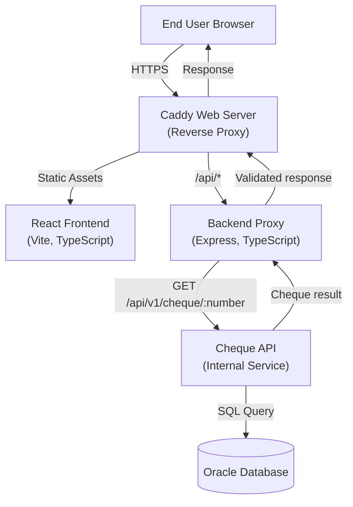

# Architecture Overview

This document describes how the cheque verification platform is structured and how requests flow through the system. It intentionally omits environment-specific secrets and infrastructure identifiers.

## High-Level Flow

Key characteristics:

- **Caddy** serves as the entry point, handling static assets and reverse-proxying API requests to the backend.
- The frontend never communicates with the upstream cheque API directly. All sensitive calls are made server-side by the backend.
- The backend enforces validation, rate limiting, and JWT-based authentication before touching internal services.
- The upstream API is responsible for business rules and database access; the backend only proxies verified requests and compares user input against authoritative data.

## Component Responsibilities

### Caddy Web Server

- Serves the compiled React frontend static assets.
- Reverse proxies `/api/*` requests to the backend service.
- Adds security headers (HSTS, CSP, X-Frame-Options).
- Provides access logging with client IP preservation.

### Frontend (`frontend/`)

- Presents the cheque verification form and related content (FAQ, notices).
- Calls `POST /api/cheque/verify` on the backend with the cheque number, payment issue date, and applied amount supplied by the user.
- Shows success, error, and validation states returned from the backend.

### Backend Proxy (`backend/`)

- Express application that accepts requests from the frontend.
- Validates payloads (format, required fields, domain constraints).
- Applies rate limits and logs metadata for observability without storing personal information.
- Fetches authoritative cheque data from the upstream API.
- Compares user-supplied values with authoritative data and returns either a `success` response or human-readable validation messages.
- Signs a short-lived JWT when calling the upstream API to avoid sending static credentials.

### Upstream Cheque API (`api/`)

- Internal service that returns authoritative cheque data.
- Connects to the database and encapsulates all data access and error handling.
- Returns structured JSON responses with cheque metadata.

## Request Lifecycle

1. End user submits the web form.
2. Frontend posts to the backend (`/api/cheque/verify`) with the supplied details.
3. Backend validates the payload. If validation fails, it returns a `400` with generic error messages to prevent information leakage.
4. Backend fetches the cheque record from the upstream API using a GET request.
5. Backend compares the amount and date provided by the user with the data.
6. Backend returns:
   - `200` + cheque payload when everything matches.
   - `400` + error list when the cheque exists but values do not match.
   - `404` when the cheque number cannot be found.
   - `5xx` when upstream dependencies fail.
7. Frontend surfaces the message to the user in a user-friendly format.
